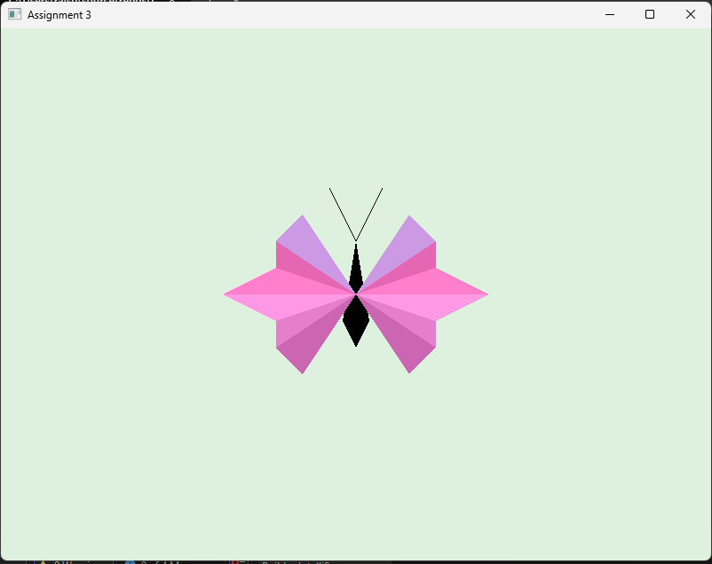

# 2D Triangle Mesh Butterfly Animation  
**Computer Graphics & Animation Lab**

## 📚 Course Info
- **Course Name:** Computer Graphics & Animation Lab  
- **Course Teacher:** Md. Reasad Zaman Chowdhury  
  Lecturer, Department of Computer Science & Engineering

## 🎯 Task Description
As part of our coursework, we were tasked with designing a 2D scenario using OpenGL that satisfies the following conditions:

1. **Must be created using 2D triangle mesh with at least 45 vertices**
2. **Uses interpolation techniques**
3. **Applies transformation matrices**
4. **Supports mouse and/or keyboard interaction**

### ✅ My Scenario: **Butterfly Animation**

This project features a colorful butterfly rendered using over 45 vertices made up of multiple triangles. The butterfly can:
- **Flap its wings** (interpolation through sine-based animation)
- **Move in all four directions** via arrow keys (transformation matrix)
- **Be repositioned** using left mouse click
- **Zoom in/out** using the mouse scroll wheel

---

## 🖼️ Screenshot
  
*A vibrant butterfly scene rendered using OpenGL triangle meshes.*

---

## ⚙️ Installation

1. **Clone the repository**
   ```bash
   git clone https://github.com/raisul447/2D-Scenario-Animation-Model-Butterfly-OpenGL.git
   cd 2D-Scenario-Animation-Model-Butterfly-OpenGL
   ```

2. **Install Dependencies**  
   Ensure you have the following installed:
   - [GLFW](https://www.glfw.org/)
   - [GLEW](http://glew.sourceforge.net/)
   - OpenGL libraries

   On Ubuntu/Debian-based systems:
   ```bash
   sudo apt-get update
   sudo apt-get install libglfw3-dev libglew-dev libglu1-mesa-dev freeglut3-dev mesa-common-dev
   ```

3. **Compile the project**
   ```bash
   g++ main.cpp -lglfw -lGL -lGLEW -o butterfly
   ```

4. **Run it**
   ```bash
   ./butterfly
   ```

---

## 🎮 Controls

| Action                  | Control        |
|-------------------------|----------------|
| Move Up                | Up Arrow       |
| Move Down              | Down Arrow     |
| Move Left              | Left Arrow     |
| Move Right             | Right Arrow    |
| Move to Mouse Position | Left Mouse Click |
| Zoom In/Out            | Mouse Scroll    |

---

## 💡 Features Implemented

- ✅ 45+ vertices using triangle meshes  
- ✅ Transformation matrix for movement  
- ✅ Interpolation using sine for animation  
- ✅ Mouse interaction for repositioning  
- ✅ Zoom functionality  

---

## 🧑‍💻 Author

**Raisul Islam** 
Batch #16 (Diploma) 
BSc in Computer Science & Engineering  
Southeast University

---

## 📄 License
This project is for educational use under the terms of the university's coursework. You are free to modify and learn from this repository.
